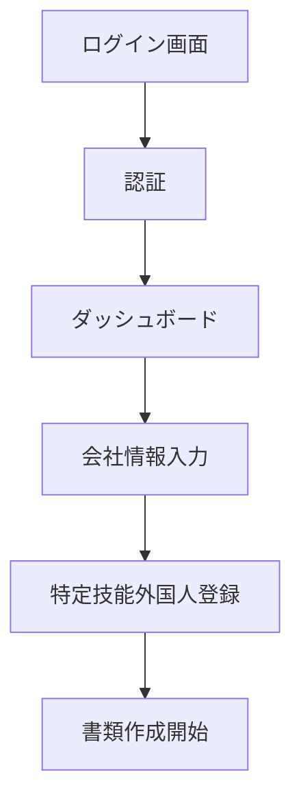
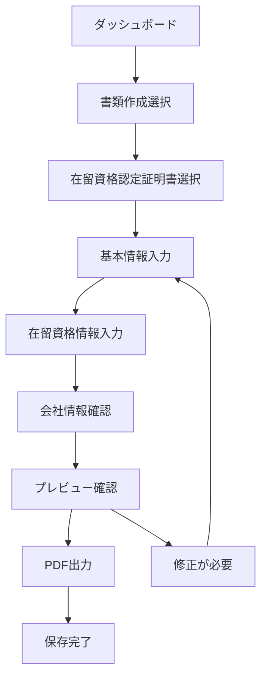
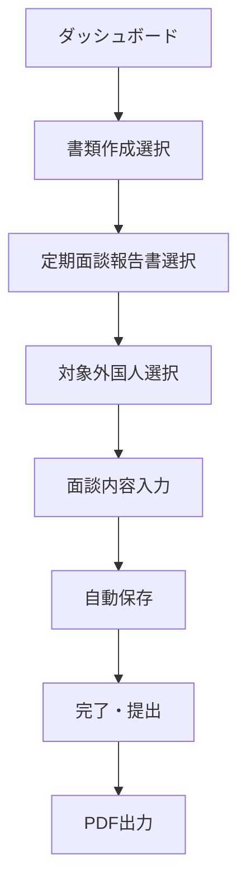
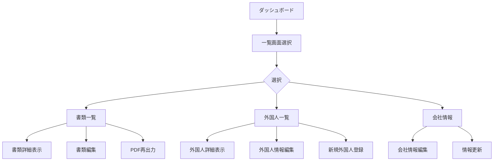
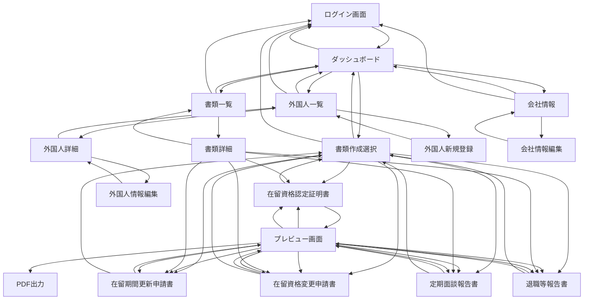
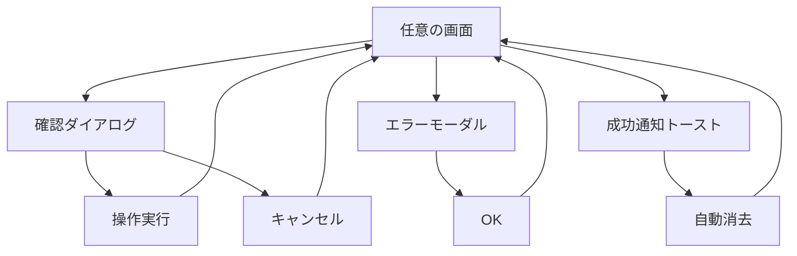

# 設計書

## 概要

特定技能在留資格管理SaaSのモック版は、ニーズ検証を目的としたフロントエンドのみのWebアプリケーションです。React + TypeScriptで開発し、静的サイトホスティングサービス（Vercel/Netlify）でデプロイします。データはハードコーディングとローカルストレージで管理し、迅速な開発とデプロイを実現します。

## アーキテクチャ

### 技術スタック
- **フロントエンド**: React 18 + TypeScript
- **スタイリング**: Tailwind CSS
- **ルーティング**: React Router v6
- **状態管理**: React Context API + useReducer
- **フォーム管理**: React Hook Form
- **PDF生成**: jsPDF + html2canvas
- **データ保存**: localStorage
- **ビルドツール**: Vite
- **デプロイ**: Vercel（推奨）

### アプリケーション構成
```
src/
├── components/          # 再利用可能なUIコンポーネント
├── pages/              # ページコンポーネント
├── hooks/              # カスタムフック
├── context/            # React Context
├── types/              # TypeScript型定義
├── data/               # ハードコーディングデータ
├── utils/              # ユーティリティ関数
└── styles/             # スタイルファイル
```

## コンポーネントとインターフェース

### 主要ページコンポーネント
1. **LoginPage** - ログイン画面
2. **DashboardPage** - ダッシュボード（メイン画面）
3. **DocumentCreatePage** - 書類作成画面
4. **DocumentListPage** - 書類一覧画面
5. **ForeignerListPage** - 特定技能外国人一覧画面
6. **CompanyInfoPage** - 会社情報画面

### 共通コンポーネント
1. **Header** - ヘッダーナビゲーション
2. **Sidebar** - サイドバーメニュー
3. **FormField** - フォーム入力フィールド
4. **Button** - ボタンコンポーネント
5. **Modal** - モーダルダイアログ
6. **LoadingSpinner** - ローディング表示

### 書類作成コンポーネント
1. **ResidenceStatusForm** - 在留資格認定証明書フォーム
2. **PeriodExtensionForm** - 在留期間更新許可申請書フォーム
3. **StatusChangeForm** - 在留資格変更許可申請書フォーム
4. **InterviewReportForm** - 定期面談報告書フォーム
5. **ResignationReportForm** - 退職等随時報告書フォーム

## データモデル

### ユーザー情報
```typescript
interface User {
  id: string;
  email: string;
  name: string;
  companyId: string;
}
```

### 特定技能外国人情報
```typescript
interface Foreigner {
  id: string;
  name: string;
  nameKana: string;
  nationality: string;
  birthDate: string;
  passportNumber: string;
  residenceStatus: string;
  residencePeriod: string;
  workCategory: string;
  companyId: string;
}
```

### 会社情報
```typescript
interface Company {
  id: string;
  name: string;
  address: string;
  representative: string;
  phone: string;
  registrationNumber: string;
}
```

### 書類情報
```typescript
interface Document {
  id: string;
  type: 'residence_status' | 'period_extension' | 'status_change' | 'interview_report' | 'resignation_report';
  title: string;
  status: 'draft' | 'submitted' | 'approved' | 'rejected';
  createdAt: string;
  updatedAt: string;
  foreignerId: string;
  data: Record<string, any>;
}
```

## エラーハンドリング

### フロントエンドエラー処理
1. **フォームバリデーション**: React Hook Formによるリアルタイムバリデーション
2. **エラー境界**: React Error Boundaryによるアプリケーションエラーキャッチ
3. **ユーザーフィードバック**: トースト通知によるエラー・成功メッセージ表示
4. **ローカルストレージエラー**: ストレージ容量不足やアクセス不可時の処理

### バリデーションルール
- 必須項目チェック
- メールアドレス形式チェック
- 日付形式チェック
- 文字数制限チェック

## テスト戦略

### テスト種別
1. **単体テスト**: Jest + React Testing Library
   - コンポーネントの動作確認
   - カスタムフックのテスト
   - ユーティリティ関数のテスト

2. **統合テスト**: React Testing Library
   - ページ間の遷移テスト
   - フォーム送信フローのテスト
   - ローカルストレージ連携テスト

3. **E2Eテスト**: Playwright（オプション）
   - 主要ユーザーフローの確認
   - ブラウザ間の互換性確認

### テスト対象
- ログイン・ログアウト機能
- 書類作成・保存機能
- PDF出力機能
- データ一覧表示機能

## パフォーマンス考慮事項

### 最適化戦略
1. **コード分割**: React.lazy()による動的インポート
2. **画像最適化**: WebP形式の使用、適切なサイズ設定
3. **バンドルサイズ**: 不要なライブラリの除去、Tree Shaking
4. **キャッシュ戦略**: ブラウザキャッシュの活用

### ローカルストレージ管理
- データサイズの監視
- 古いデータの自動削除
- ストレージ容量制限への対応

## セキュリティ考慮事項

### フロントエンドセキュリティ
1. **XSS対策**: React標準のエスケープ処理
2. **入力値検証**: フロントエンド側でのバリデーション
3. **機密情報**: ローカルストレージに機密情報を保存しない
4. **HTTPS**: 本番環境でのHTTPS必須

### 認証・認可
- 簡易認証（ハードコーディング）
- セッション管理（ローカルストレージ）
- ルートガード（未認証時のリダイレクト）

## デプロイメント戦略

### 静的サイトホスティング
1. **Vercel（推奨）**
   - GitHub連携による自動デプロイ
   - プレビューデプロイ機能
   - カスタムドメイン対応

2. **Netlify（代替案）**
   - 同様の機能を提供
   - フォーム処理機能

### ビルド設定
- 本番用最適化ビルド
- 環境変数による設定管理
- ソースマップの除外

## UIデザイン設計

### デザインシステム

#### カラーパレット
```css
/* プライマリカラー */
--primary-50: #eff6ff;
--primary-500: #3b82f6;  /* メインブルー */
--primary-600: #2563eb;
--primary-700: #1d4ed8;

/* セカンダリカラー */
--gray-50: #f9fafb;
--gray-100: #f3f4f6;
--gray-500: #6b7280;
--gray-700: #374151;
--gray-900: #111827;

/* ステータスカラー */
--success: #10b981;    /* 承認済み */
--warning: #f59e0b;    /* 申請中 */
--error: #ef4444;      /* 却下 */
--info: #06b6d4;       /* 下書き */
```

#### タイポグラフィ
```css
/* フォントファミリー */
font-family: 'Noto Sans JP', -apple-system, BlinkMacSystemFont, sans-serif;

/* フォントサイズ */
--text-xs: 0.75rem;    /* 12px - キャプション */
--text-sm: 0.875rem;   /* 14px - 補助テキスト */
--text-base: 1rem;     /* 16px - 本文 */
--text-lg: 1.125rem;   /* 18px - 小見出し */
--text-xl: 1.25rem;    /* 20px - 見出し */
--text-2xl: 1.5rem;    /* 24px - ページタイトル */
--text-3xl: 1.875rem;  /* 30px - メインタイトル */
```

#### スペーシング
```css
--spacing-1: 0.25rem;  /* 4px */
--spacing-2: 0.5rem;   /* 8px */
--spacing-3: 0.75rem;  /* 12px */
--spacing-4: 1rem;     /* 16px */
--spacing-6: 1.5rem;   /* 24px */
--spacing-8: 2rem;     /* 32px */
```

### レイアウト設計

#### 全体レイアウト
```
┌─────────────────────────────────────┐
│ Header (固定ヘッダー)                │
├─────────┬───────────────────────────┤
│         │                         │
│ Sidebar │ Main Content            │
│ (固定)  │ (スクロール可能)         │
│         │                         │
│         │                         │
└─────────┴───────────────────────────┘
```

#### ヘッダー設計
- 高さ: 64px
- 左側: ロゴ・アプリ名
- 右側: ユーザー名・ログアウトボタン
- 背景: 白色、下部にシャドウ

#### サイドバー設計
- 幅: 256px（デスクトップ）、モバイルではオーバーレイ
- メニュー項目:
  - ダッシュボード
  - 書類作成 (サブメニュー展開)
  - 書類一覧
  - 特定技能外国人一覧
  - 会社情報
- アクティブ状態の視覚的表示

### ページ別UI設計

#### 1. ログイン画面
```
┌─────────────────────────────────────┐
│                                     │
│        [ロゴ・アプリ名]              │
│                                     │
│    ┌─────────────────────────┐      │
│    │ 特定技能在留資格管理     │      │
│    │                         │      │
│    │ [メールアドレス入力]     │      │
│    │ [パスワード入力]         │      │
│    │                         │      │
│    │     [ログインボタン]     │      │
│    └─────────────────────────┘      │
│                                     │
└─────────────────────────────────────┘
```

#### 2. ダッシュボード
```
┌─────────────────────────────────────┐
│ 概要カード群                        │
├─────────┬─────────┬─────────────────┤
│ 申請中  │ 承認済み │ 今月の申請数     │
│   5件   │   12件   │     8件         │
└─────────┴─────────┴─────────────────┤
│                                     │
│ 最近の活動                          │
│ ┌─────────────────────────────────┐ │
│ │ • 田中太郎さんの更新申請を作成   │ │
│ │ • 佐藤花子さんの面談報告を提出   │ │
│ │ • 新規外国人情報を登録           │ │
│ └─────────────────────────────────┘ │
└─────────────────────────────────────┘
```

#### 3. 書類作成フォーム
```
┌─────────────────────────────────────┐
│ [戻る] 在留資格認定証明書交付申請書   │
├─────────────────────────────────────┤
│                                     │
│ 基本情報                            │
│ ┌─────────────────────────────────┐ │
│ │ 氏名: [入力フィールド]           │ │
│ │ 生年月日: [日付選択]             │ │
│ │ 国籍: [選択ボックス]             │ │
│ └─────────────────────────────────┘ │
│                                     │
│ 在留資格情報                        │
│ ┌─────────────────────────────────┐ │
│ │ 在留資格: [選択ボックス]         │ │
│ │ 在留期間: [選択ボックス]         │ │
│ └─────────────────────────────────┘ │
│                                     │
│ [プレビュー] [PDF出力] [保存]       │
└─────────────────────────────────────┘
```

#### 4. 一覧画面
```
┌─────────────────────────────────────┐
│ 書類一覧                 [新規作成] │
├─────────────────────────────────────┤
│ [検索] [フィルター: 全て ▼]         │
├─────────────────────────────────────┤
│                                     │
│ ┌─────────────────────────────────┐ │
│ │ 📄 在留資格認定証明書            │ │
│ │    田中太郎 | 申請中 | 2024/01/15│ │
│ │    [編集] [PDF] [削除]          │ │
│ └─────────────────────────────────┘ │
│                                     │
│ ┌─────────────────────────────────┐ │
│ │ 📄 定期面談報告書                │ │
│ │    佐藤花子 | 承認済み | 2024/01/10│ │
│ │    [表示] [PDF] [削除]          │ │
│ └─────────────────────────────────┘ │
└─────────────────────────────────────┘
```

### コンポーネント設計

#### ボタンコンポーネント
```typescript
// プライマリボタン
<Button variant="primary" size="md">
  保存
</Button>

// セカンダリボタン
<Button variant="secondary" size="md">
  キャンセル
</Button>

// 危険操作ボタン
<Button variant="danger" size="sm">
  削除
</Button>
```

#### フォームフィールドコンポーネント
```typescript
<FormField
  label="氏名"
  type="text"
  required
  error={errors.name}
  placeholder="山田太郎"
/>
```

#### ステータスバッジコンポーネント
```typescript
<StatusBadge status="submitted">申請中</StatusBadge>
<StatusBadge status="approved">承認済み</StatusBadge>
<StatusBadge status="draft">下書き</StatusBadge>
```

### レスポンシブデザイン

#### ブレークポイント
```css
/* モバイル */
@media (max-width: 768px) {
  - サイドバーをハンバーガーメニューに変更
  - フォームを1カラムレイアウトに変更
  - テーブルをカードレイアウトに変更
}

/* タブレット */
@media (min-width: 769px) and (max-width: 1024px) {
  - サイドバー幅を200pxに縮小
  - フォームを2カラムレイアウトに調整
}

/* デスクトップ */
@media (min-width: 1025px) {
  - フルレイアウト表示
  - 3カラムフォームレイアウト
}
```

### アクセシビリティ設計

#### キーボードナビゲーション
- Tab順序の論理的な設定
- フォーカス表示の明確化
- Enterキーでのボタン実行

#### スクリーンリーダー対応
- 適切なARIAラベルの設定
- セマンティックHTMLの使用
- 画像のalt属性設定

#### カラーアクセシビリティ
- WCAG 2.1 AA準拠のコントラスト比
- 色だけに依存しない情報伝達
- ダークモード対応（将来拡張）

## ユーザーフロー設計

### 主要ユーザーフロー

#### 1. 初回利用フロー


#### 2. 書類作成フロー（在留資格認定証明書）


#### 3. 支援業務報告フロー（定期面談）


#### 4. 情報管理フロー


### 典型的な利用パターン

#### パターン1: 新規申請業務
1. **ログイン** → ダッシュボード確認
2. **外国人情報登録** → 基本情報・在留資格情報入力
3. **書類作成** → 在留資格認定証明書作成
4. **確認・出力** → プレビュー確認後PDF出力
5. **保存** → 申請中ステータスで保存

#### パターン2: 定期報告業務
1. **ログイン** → ダッシュボード確認
2. **報告書作成** → 定期面談報告書選択
3. **対象者選択** → 登録済み外国人から選択
4. **面談内容入力** → 詳細な面談記録入力
5. **提出・保存** → PDF出力して完了

#### パターン3: 情報確認・管理
1. **ログイン** → ダッシュボード確認
2. **一覧確認** → 書類一覧で進捗確認
3. **詳細確認** → 個別書類の詳細表示
4. **必要に応じて編集** → 情報更新
5. **再出力** → 最新情報でPDF再生成

## 画面遷移図

### 全体画面遷移


### モーダル・オーバーレイ遷移


### ナビゲーション動作

#### ヘッダーナビゲーション
- **ロゴクリック** → ダッシュボードに遷移
- **ユーザー名クリック** → ドロップダウンメニュー表示
- **ログアウト** → ログイン画面に遷移

#### サイドバーナビゲーション
- **ダッシュボード** → ダッシュボードに遷移
- **書類作成** → サブメニュー展開/折りたたみ
- **各書類種別** → 対応する書類作成画面に遷移
- **書類一覧** → 書類一覧画面に遷移
- **外国人一覧** → 外国人一覧画面に遷移
- **会社情報** → 会社情報画面に遷移

#### 戻るボタン動作
- **書類作成画面** → 書類作成選択画面
- **プレビュー画面** → 元の書類作成画面
- **詳細画面** → 対応する一覧画面
- **編集画面** → 対応する詳細画面

#### ブラウザ戻るボタン対応
- React Routerの履歴管理を使用
- 適切な画面遷移を保持
- フォーム入力中の場合は確認ダイアログ表示

## 今後の拡張性

### バックエンド連携準備
- API通信用のサービス層設計
- 認証トークン管理の準備
- データ同期機能の設計

### 機能拡張
- 多言語対応（i18n）
- 通知機能
- ファイルアップロード機能
- 印刷最適化