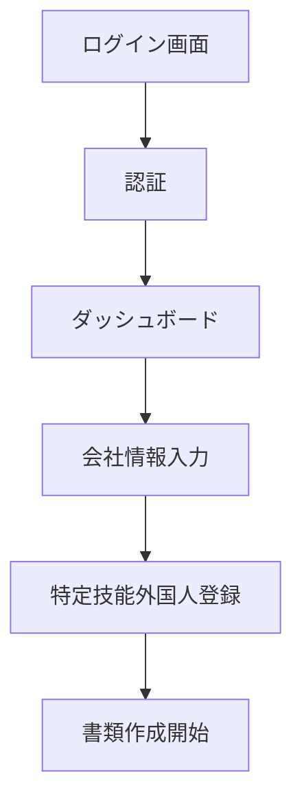
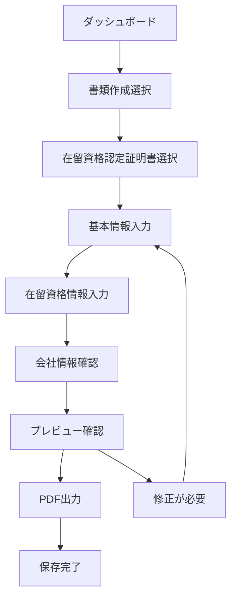
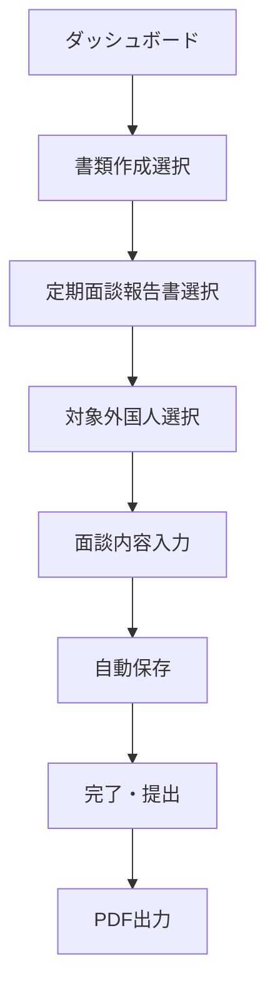
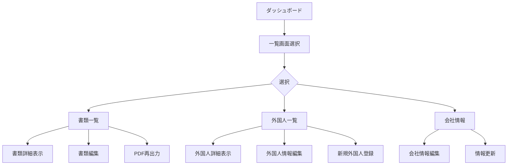
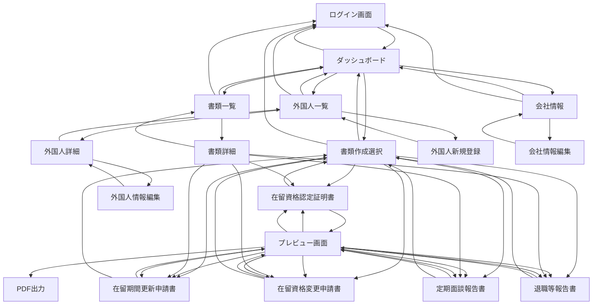
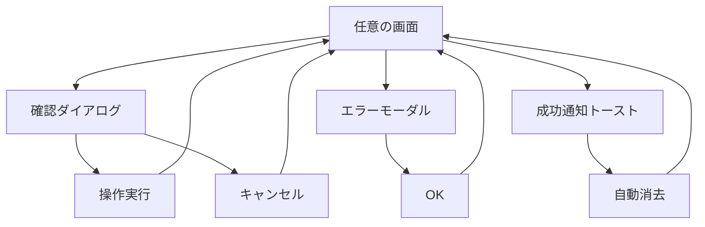

# 設計書

## 概要

特定技能在留資格管理SaaSのモック版は、ニーズ検証を目的としたフロントエンドのみのWebアプリケーションです。React + TypeScriptで開発し、静的サイトホスティングサービス（Vercel/Netlify）でデプロイします。データはハードコーディングとローカルストレージで管理し、迅速な開発とデプロイを実現します。

## アーキテクチャ

### 技術スタック
- **フロントエンド**: React 18 + TypeScript
- **UIコンポーネント**: shadcn/ui
- **スタイリング**: Tailwind CSS
- **ルーティング**: React Router v6
- **状態管理**: React Context API + useReducer
- **フォーム管理**: React Hook Form + Zod
- **PDF生成**: jsPDF + html2canvas
- **データ保存**: localStorage
- **ビルドツール**: Vite
- **デプロイ**: Vercel（推奨）
- **アイコン**: Lucide React

### アプリケーション構成
```
src/
├── components/          # 再利用可能なUIコンポーネント
│   ├── ui/             # shadcn/uiコンポーネント
│   └── custom/         # カスタムコンポーネント
├── pages/              # ページコンポーネント
├── hooks/              # カスタムフック
├── context/            # React Context
├── types/              # TypeScript型定義
├── data/               # ハードコーディングデータ
├── utils/              # ユーティリティ関数
├── lib/                # ライブラリ設定（shadcn/ui utils等）
└── styles/             # スタイルファイル
```

## コンポーネントとインターフェース

### 主要ページコンポーネント
1. **LoginPage** - ログイン画面
2. **DashboardPage** - ダッシュボード（メイン画面）
3. **DocumentCreatePage** - 書類作成画面
4. **DocumentListPage** - 書類一覧画面
5. **ForeignerListPage** - 特定技能外国人一覧画面
6. **CompanyInfoPage** - 会社情報画面

### 共通コンポーネント

#### shadcn/uiベースコンポーネント
1. **Button** - ボタンコンポーネント（shadcn/ui）
2. **Input** - 入力フィールド（shadcn/ui）
3. **Select** - セレクトボックス（shadcn/ui）
4. **Dialog** - モーダルダイアログ（shadcn/ui）
5. **Card** - カードコンポーネント（shadcn/ui）
6. **Badge** - ステータスバッジ（shadcn/ui）
7. **Table** - テーブルコンポーネント（shadcn/ui）
8. **Form** - フォームコンポーネント（shadcn/ui + React Hook Form）
9. **Toast** - 通知コンポーネント（shadcn/ui）
10. **Sheet** - サイドシート（shadcn/ui）

#### カスタムコンポーネント
1. **Header** - ヘッダーナビゲーション
2. **Sidebar** - サイドバーメニュー
3. **LoadingSpinner** - ローディング表示
4. **StatusBadge** - ステータス表示（Badgeをラップ）
5. **FormField** - フォーム入力フィールド（shadcn/ui Formをラップ）

### 書類作成コンポーネント
1. **ResidenceStatusForm** - 在留資格認定証明書フォーム
2. **PeriodExtensionForm** - 在留期間更新許可申請書フォーム
3. **StatusChangeForm** - 在留資格変更許可申請書フォーム
4. **InterviewReportForm** - 定期面談報告書フォーム
5. **ResignationReportForm** - 退職等随時報告書フォーム

## データモデル

### ユーザー情報
```typescript
interface User {
  id: string;
  email: string;
  name: string;
  companyId: string;
}
```

### 特定技能外国人情報
```typescript
interface Foreigner {
  id: string;
  name: string;
  nameKana: string;
  nationality: string;
  birthDate: string;
  passportNumber: string;
  residenceStatus: string;
  residencePeriod: string;
  workCategory: string;
  companyId: string;
}
```

### 会社情報
```typescript
interface Company {
  id: string;
  name: string;
  address: string;
  representative: string;
  phone: string;
  registrationNumber: string;
}
```

### 書類情報
```typescript
interface Document {
  id: string;
  type: 'residence_status' | 'period_extension' | 'status_change' | 'interview_report' | 'resignation_report';
  title: string;
  status: 'draft' | 'submitted' | 'approved' | 'rejected';
  createdAt: string;
  updatedAt: string;
  foreignerId: string;
  data: Record<string, any>;
}
```

## エラーハンドリング

### フロントエンドエラー処理
1. **フォームバリデーション**: React Hook Formによるリアルタイムバリデーション
2. **エラー境界**: React Error Boundaryによるアプリケーションエラーキャッチ
3. **ユーザーフィードバック**: トースト通知によるエラー・成功メッセージ表示
4. **ローカルストレージエラー**: ストレージ容量不足やアクセス不可時の処理

### バリデーションルール
- 必須項目チェック
- メールアドレス形式チェック
- 日付形式チェック
- 文字数制限チェック

## テスト戦略

### テスト種別
1. **単体テスト**: Jest + React Testing Library
   - コンポーネントの動作確認
   - カスタムフックのテスト
   - ユーティリティ関数のテスト

2. **統合テスト**: React Testing Library
   - ページ間の遷移テスト
   - フォーム送信フローのテスト
   - ローカルストレージ連携テスト

3. **E2Eテスト**: Playwright（オプション）
   - 主要ユーザーフローの確認
   - ブラウザ間の互換性確認

### テスト対象
- ログイン・ログアウト機能
- 書類作成・保存機能
- PDF出力機能
- データ一覧表示機能

## パフォーマンス考慮事項

### 最適化戦略
1. **コード分割**: React.lazy()による動的インポート
2. **画像最適化**: WebP形式の使用、適切なサイズ設定
3. **バンドルサイズ**: 不要なライブラリの除去、Tree Shaking
4. **キャッシュ戦略**: ブラウザキャッシュの活用

### ローカルストレージ管理
- データサイズの監視
- 古いデータの自動削除
- ストレージ容量制限への対応

## セキュリティ考慮事項

### フロントエンドセキュリティ
1. **XSS対策**: React標準のエスケープ処理
2. **入力値検証**: フロントエンド側でのバリデーション
3. **機密情報**: ローカルストレージに機密情報を保存しない
4. **HTTPS**: 本番環境でのHTTPS必須

### 認証・認可
- 簡易認証（ハードコーディング）
- セッション管理（ローカルストレージ）
- ルートガード（未認証時のリダイレクト）

## デプロイメント戦略

### 静的サイトホスティング
1. **Vercel（推奨）**
   - GitHub連携による自動デプロイ
   - プレビューデプロイ機能
   - カスタムドメイン対応

2. **Netlify（代替案）**
   - 同様の機能を提供
   - フォーム処理機能

### ビルド設定
- 本番用最適化ビルド
- 環境変数による設定管理
- ソースマップの除外

## UIデザイン設計

### デザインシステム（shadcn/ui準拠）

#### カラーパレット
shadcn/uiのデフォルトカラーシステムを使用し、CSS変数で管理：

```css
/* ライトモード */
:root {
  --background: 0 0% 100%;
  --foreground: 222.2 84% 4.9%;
  --card: 0 0% 100%;
  --card-foreground: 222.2 84% 4.9%;
  --popover: 0 0% 100%;
  --popover-foreground: 222.2 84% 4.9%;
  --primary: 221.2 83.2% 53.3%;
  --primary-foreground: 210 40% 98%;
  --secondary: 210 40% 96%;
  --secondary-foreground: 222.2 84% 4.9%;
  --muted: 210 40% 96%;
  --muted-foreground: 215.4 16.3% 46.9%;
  --accent: 210 40% 96%;
  --accent-foreground: 222.2 84% 4.9%;
  --destructive: 0 84.2% 60.2%;
  --destructive-foreground: 210 40% 98%;
  --border: 214.3 31.8% 91.4%;
  --input: 214.3 31.8% 91.4%;
  --ring: 221.2 83.2% 53.3%;
  --radius: 0.5rem;
}

/* カスタムステータスカラー */
:root {
  --status-draft: 210 40% 96%;      /* 下書き - グレー */
  --status-submitted: 45 93% 47%;   /* 申請中 - イエロー */
  --status-approved: 142 76% 36%;   /* 承認済み - グリーン */
  --status-rejected: 0 84% 60%;     /* 却下 - レッド */
}
```

#### タイポグラフィ
shadcn/uiのタイポグラフィシステムを使用：

```css
/* フォントファミリー */
font-family: 'Noto Sans JP', ui-sans-serif, system-ui, -apple-system, BlinkMacSystemFont, sans-serif;

/* Tailwind CSS Typography Classes */
.text-xs     /* 12px */
.text-sm     /* 14px */
.text-base   /* 16px */
.text-lg     /* 18px */
.text-xl     /* 20px */
.text-2xl    /* 24px */
.text-3xl    /* 30px */
.text-4xl    /* 36px */
```

#### スペーシング
Tailwind CSSのスペーシングシステムを使用：

```css
.p-1   /* 4px */
.p-2   /* 8px */
.p-3   /* 12px */
.p-4   /* 16px */
.p-6   /* 24px */
.p-8   /* 32px */
```

### レイアウト設計

#### 全体レイアウト
```
┌─────────────────────────────────────┐
│ Header (固定ヘッダー)                │
├─────────┬───────────────────────────┤
│         │                         │
│ Sidebar │ Main Content            │
│ (固定)  │ (スクロール可能)         │
│         │                         │
│         │                         │
└─────────┴───────────────────────────┘
```

#### ヘッダー設計
- 高さ: 64px
- 左側: ロゴ・アプリ名
- 右側: ユーザー名・ログアウトボタン
- 背景: 白色、下部にシャドウ

#### サイドバー設計
- 幅: 256px（デスクトップ）、モバイルではオーバーレイ
- メニュー項目:
  - ダッシュボード
  - 書類作成 (サブメニュー展開)
  - 書類一覧
  - 特定技能外国人一覧
  - 会社情報
- アクティブ状態の視覚的表示

### ページ別UI設計

#### 1. ログイン画面
```
┌─────────────────────────────────────┐
│                                     │
│        [ロゴ・アプリ名]              │
│                                     │
│    ┌─────────────────────────┐      │
│    │ 特定技能在留資格管理     │      │
│    │                         │      │
│    │ [メールアドレス入力]     │      │
│    │ [パスワード入力]         │      │
│    │                         │      │
│    │     [ログインボタン]     │      │
│    └─────────────────────────┘      │
│                                     │
└─────────────────────────────────────┘
```

#### 2. ダッシュボード
```
┌─────────────────────────────────────┐
│ 概要カード群                        │
├─────────┬─────────┬─────────────────┤
│ 申請中  │ 承認済み │ 今月の申請数     │
│   5件   │   12件   │     8件         │
└─────────┴─────────┴─────────────────┤
│                                     │
│ 最近の活動                          │
│ ┌─────────────────────────────────┐ │
│ │ • 田中太郎さんの更新申請を作成   │ │
│ │ • 佐藤花子さんの面談報告を提出   │ │
│ │ • 新規外国人情報を登録           │ │
│ └─────────────────────────────────┘ │
└─────────────────────────────────────┘
```

#### 3. 書類作成フォーム（shadcn/ui使用）
```typescript
// レイアウト例
<div className="container mx-auto p-6">
  <div className="flex items-center gap-4 mb-6">
    <Button variant="ghost" size="sm">
      <ArrowLeft className="h-4 w-4 mr-2" />
      戻る
    </Button>
    <h1 className="text-2xl font-bold">在留資格認定証明書交付申請書</h1>
  </div>

  <Form {...form}>
    <form onSubmit={form.handleSubmit(onSubmit)} className="space-y-6">
      <Card>
        <CardHeader>
          <CardTitle>基本情報</CardTitle>
        </CardHeader>
        <CardContent className="grid grid-cols-1 md:grid-cols-2 gap-4">
          <FormField
            control={form.control}
            name="name"
            render={({ field }) => (
              <FormItem>
                <FormLabel>氏名</FormLabel>
                <FormControl>
                  <Input placeholder="山田太郎" {...field} />
                </FormControl>
                <FormMessage />
              </FormItem>
            )}
          />
          <FormField
            control={form.control}
            name="birthDate"
            render={({ field }) => (
              <FormItem>
                <FormLabel>生年月日</FormLabel>
                <FormControl>
                  <Input type="date" {...field} />
                </FormControl>
                <FormMessage />
              </FormItem>
            )}
          />
        </CardContent>
      </Card>

      <Card>
        <CardHeader>
          <CardTitle>在留資格情報</CardTitle>
        </CardHeader>
        <CardContent className="grid grid-cols-1 md:grid-cols-2 gap-4">
          <FormField
            control={form.control}
            name="residenceStatus"
            render={({ field }) => (
              <FormItem>
                <FormLabel>在留資格</FormLabel>
                <Select onValueChange={field.onChange} defaultValue={field.value}>
                  <FormControl>
                    <SelectTrigger>
                      <SelectValue placeholder="在留資格を選択" />
                    </SelectTrigger>
                  </FormControl>
                  <SelectContent>
                    <SelectItem value="specified-skilled-worker">特定技能</SelectItem>
                  </SelectContent>
                </Select>
                <FormMessage />
              </FormItem>
            )}
          />
        </CardContent>
      </Card>

      <div className="flex justify-end gap-2">
        <Button type="button" variant="outline">
          プレビュー
        </Button>
        <Button type="button" variant="outline">
          PDF出力
        </Button>
        <Button type="submit">
          保存
        </Button>
      </div>
    </form>
  </Form>
</div>
```

#### 4. 一覧画面（shadcn/ui使用）
```typescript
// レイアウト例
<div className="container mx-auto p-6">
  <div className="flex justify-between items-center mb-6">
    <h1 className="text-2xl font-bold">書類一覧</h1>
    <Button>
      <Plus className="h-4 w-4 mr-2" />
      新規作成
    </Button>
  </div>

  <div className="flex gap-4 mb-6">
    <div className="flex-1">
      <Input
        placeholder="書類を検索..."
        value={searchTerm}
        onChange={(e) => setSearchTerm(e.target.value)}
        className="max-w-sm"
      />
    </div>
    <Select value={statusFilter} onValueChange={setStatusFilter}>
      <SelectTrigger className="w-[180px]">
        <SelectValue placeholder="ステータス" />
      </SelectTrigger>
      <SelectContent>
        <SelectItem value="all">全て</SelectItem>
        <SelectItem value="draft">下書き</SelectItem>
        <SelectItem value="submitted">申請中</SelectItem>
        <SelectItem value="approved">承認済み</SelectItem>
      </SelectContent>
    </Select>
  </div>

  <div className="grid gap-4">
    {documents.map((doc) => (
      <Card key={doc.id}>
        <CardContent className="p-6">
          <div className="flex items-center justify-between">
            <div className="flex items-center gap-4">
              <FileText className="h-8 w-8 text-blue-500" />
              <div>
                <h3 className="font-semibold">{doc.title}</h3>
                <div className="flex items-center gap-2 text-sm text-muted-foreground">
                  <span>{doc.foreignerName}</span>
                  <span>•</span>
                  <StatusBadge status={doc.status}>
                    {getStatusLabel(doc.status)}
                  </StatusBadge>
                  <span>•</span>
                  <span>{formatDate(doc.createdAt)}</span>
                </div>
              </div>
            </div>
            <div className="flex gap-2">
              <Button variant="outline" size="sm">
                <Edit className="h-4 w-4 mr-2" />
                編集
              </Button>
              <Button variant="outline" size="sm">
                <Download className="h-4 w-4 mr-2" />
                PDF
              </Button>
              <Button variant="destructive" size="sm">
                <Trash2 className="h-4 w-4" />
              </Button>
            </div>
          </div>
        </CardContent>
      </Card>
    ))}
  </div>
</div>
```

### コンポーネント設計（shadcn/ui準拠）

#### ボタンコンポーネント
```typescript
import { Button } from "@/components/ui/button"

// プライマリボタン
<Button variant="default" size="default">
  保存
</Button>

// セカンダリボタン
<Button variant="secondary" size="default">
  キャンセル
</Button>

// 危険操作ボタン
<Button variant="destructive" size="sm">
  削除
</Button>

// アウトラインボタン
<Button variant="outline" size="default">
  プレビュー
</Button>
```

#### フォームコンポーネント
```typescript
import { Form, FormControl, FormField, FormItem, FormLabel, FormMessage } from "@/components/ui/form"
import { Input } from "@/components/ui/input"
import { useForm } from "react-hook-form"
import { zodResolver } from "@hookform/resolvers/zod"
import * as z from "zod"

const formSchema = z.object({
  name: z.string().min(1, "氏名は必須です"),
})

<Form {...form}>
  <form onSubmit={form.handleSubmit(onSubmit)}>
    <FormField
      control={form.control}
      name="name"
      render={({ field }) => (
        <FormItem>
          <FormLabel>氏名</FormLabel>
          <FormControl>
            <Input placeholder="山田太郎" {...field} />
          </FormControl>
          <FormMessage />
        </FormItem>
      )}
    />
  </form>
</Form>
```

#### セレクトコンポーネント
```typescript
import { Select, SelectContent, SelectItem, SelectTrigger, SelectValue } from "@/components/ui/select"

<FormField
  control={form.control}
  name="nationality"
  render={({ field }) => (
    <FormItem>
      <FormLabel>国籍</FormLabel>
      <Select onValueChange={field.onChange} defaultValue={field.value}>
        <FormControl>
          <SelectTrigger>
            <SelectValue placeholder="国籍を選択" />
          </SelectTrigger>
        </FormControl>
        <SelectContent>
          <SelectItem value="japan">日本</SelectItem>
          <SelectItem value="vietnam">ベトナム</SelectItem>
          <SelectItem value="philippines">フィリピン</SelectItem>
        </SelectContent>
      </Select>
      <FormMessage />
    </FormItem>
  )}
/>
```

#### ステータスバッジコンポーネント
```typescript
import { Badge } from "@/components/ui/badge"
import { cn } from "@/lib/utils"

interface StatusBadgeProps {
  status: 'draft' | 'submitted' | 'approved' | 'rejected'
  children: React.ReactNode
}

const StatusBadge = ({ status, children }: StatusBadgeProps) => {
  return (
    <Badge 
      variant={status === 'approved' ? 'default' : 'secondary'}
      className={cn(
        status === 'draft' && 'bg-gray-100 text-gray-800',
        status === 'submitted' && 'bg-yellow-100 text-yellow-800',
        status === 'approved' && 'bg-green-100 text-green-800',
        status === 'rejected' && 'bg-red-100 text-red-800'
      )}
    >
      {children}
    </Badge>
  )
}
```

#### カードコンポーネント
```typescript
import { Card, CardContent, CardDescription, CardHeader, CardTitle } from "@/components/ui/card"

<Card>
  <CardHeader>
    <CardTitle>在留資格認定証明書</CardTitle>
    <CardDescription>田中太郎 | 2024/01/15</CardDescription>
  </CardHeader>
  <CardContent>
    <div className="flex gap-2">
      <Button variant="outline" size="sm">編集</Button>
      <Button variant="outline" size="sm">PDF</Button>
      <Button variant="destructive" size="sm">削除</Button>
    </div>
  </CardContent>
</Card>
```

#### テーブルコンポーネント
```typescript
import { Table, TableBody, TableCell, TableHead, TableHeader, TableRow } from "@/components/ui/table"

<Table>
  <TableHeader>
    <TableRow>
      <TableHead>書類種別</TableHead>
      <TableHead>対象者</TableHead>
      <TableHead>ステータス</TableHead>
      <TableHead>作成日</TableHead>
      <TableHead>操作</TableHead>
    </TableRow>
  </TableHeader>
  <TableBody>
    <TableRow>
      <TableCell>在留資格認定証明書</TableCell>
      <TableCell>田中太郎</TableCell>
      <TableCell>
        <StatusBadge status="submitted">申請中</StatusBadge>
      </TableCell>
      <TableCell>2024/01/15</TableCell>
      <TableCell>
        <div className="flex gap-2">
          <Button variant="outline" size="sm">編集</Button>
          <Button variant="outline" size="sm">PDF</Button>
        </div>
      </TableCell>
    </TableRow>
  </TableBody>
</Table>
```

#### ダイアログコンポーネント
```typescript
import { Dialog, DialogContent, DialogDescription, DialogHeader, DialogTitle, DialogTrigger } from "@/components/ui/dialog"

<Dialog>
  <DialogTrigger asChild>
    <Button variant="destructive">削除</Button>
  </DialogTrigger>
  <DialogContent>
    <DialogHeader>
      <DialogTitle>書類を削除しますか？</DialogTitle>
      <DialogDescription>
        この操作は取り消すことができません。
      </DialogDescription>
    </DialogHeader>
    <div className="flex justify-end gap-2">
      <Button variant="outline">キャンセル</Button>
      <Button variant="destructive">削除</Button>
    </div>
  </DialogContent>
</Dialog>
```

#### トーストコンポーネント
```typescript
import { toast } from "@/components/ui/use-toast"

// 成功通知
toast({
  title: "保存完了",
  description: "書類が正常に保存されました。",
})

// エラー通知
toast({
  title: "エラー",
  description: "保存に失敗しました。",
  variant: "destructive",
})
```

### レスポンシブデザイン（Tailwind CSS準拠）

#### ブレークポイント
Tailwind CSSのレスポンシブプレフィックスを使用：

```typescript
// モバイルファースト設計
<div className="grid grid-cols-1 md:grid-cols-2 lg:grid-cols-3 gap-4">
  {/* モバイル: 1列, タブレット: 2列, デスクトップ: 3列 */}
</div>

// サイドバーのレスポンシブ対応
<Sheet>
  <SheetTrigger asChild>
    <Button variant="outline" size="icon" className="md:hidden">
      <Menu className="h-4 w-4" />
    </Button>
  </SheetTrigger>
  <SheetContent side="left" className="w-64">
    {/* モバイル用サイドバー */}
  </SheetContent>
</Sheet>

// デスクトップ用固定サイドバー
<div className="hidden md:flex md:w-64 md:flex-col">
  {/* デスクトップ用サイドバー */}
</div>
```

#### レスポンシブ対応
- **モバイル（sm未満）**: 
  - サイドバーをSheetコンポーネントでオーバーレイ表示
  - フォームを1カラムレイアウト
  - テーブルをCardレイアウトに変更
  - ボタンサイズを調整

- **タブレット（md）**: 
  - サイドバー幅を調整
  - フォームを2カラムレイアウト
  - テーブル表示を維持

- **デスクトップ（lg以上）**: 
  - フルレイアウト表示
  - 3カラムフォームレイアウト
  - 全機能を表示

### アクセシビリティ設計

#### キーボードナビゲーション
- Tab順序の論理的な設定
- フォーカス表示の明確化
- Enterキーでのボタン実行

#### スクリーンリーダー対応
- 適切なARIAラベルの設定
- セマンティックHTMLの使用
- 画像のalt属性設定

#### カラーアクセシビリティ
- WCAG 2.1 AA準拠のコントラスト比
- 色だけに依存しない情報伝達
- ダークモード対応（将来拡張）

## ユーザーフロー設計

### 主要ユーザーフロー

#### 1. 初回利用フロー


#### 2. 書類作成フロー（在留資格認定証明書）


#### 3. 支援業務報告フロー（定期面談）


#### 4. 情報管理フロー


### 典型的な利用パターン

#### パターン1: 新規申請業務
1. **ログイン** → ダッシュボード確認
2. **外国人情報登録** → 基本情報・在留資格情報入力
3. **書類作成** → 在留資格認定証明書作成
4. **確認・出力** → プレビュー確認後PDF出力
5. **保存** → 申請中ステータスで保存

#### パターン2: 定期報告業務
1. **ログイン** → ダッシュボード確認
2. **報告書作成** → 定期面談報告書選択
3. **対象者選択** → 登録済み外国人から選択
4. **面談内容入力** → 詳細な面談記録入力
5. **提出・保存** → PDF出力して完了

#### パターン3: 情報確認・管理
1. **ログイン** → ダッシュボード確認
2. **一覧確認** → 書類一覧で進捗確認
3. **詳細確認** → 個別書類の詳細表示
4. **必要に応じて編集** → 情報更新
5. **再出力** → 最新情報でPDF再生成

## 画面遷移図

### 全体画面遷移


### モーダル・オーバーレイ遷移


### ナビゲーション動作

#### ヘッダーナビゲーション
- **ロゴクリック** → ダッシュボードに遷移
- **ユーザー名クリック** → ドロップダウンメニュー表示
- **ログアウト** → ログイン画面に遷移

#### サイドバーナビゲーション
- **ダッシュボード** → ダッシュボードに遷移
- **書類作成** → サブメニュー展開/折りたたみ
- **各書類種別** → 対応する書類作成画面に遷移
- **書類一覧** → 書類一覧画面に遷移
- **外国人一覧** → 外国人一覧画面に遷移
- **会社情報** → 会社情報画面に遷移

#### 戻るボタン動作
- **書類作成画面** → 書類作成選択画面
- **プレビュー画面** → 元の書類作成画面
- **詳細画面** → 対応する一覧画面
- **編集画面** → 対応する詳細画面

#### ブラウザ戻るボタン対応
- React Routerの履歴管理を使用
- 適切な画面遷移を保持
- フォーム入力中の場合は確認ダイアログ表示

## shadcn/ui導入による利点

### 開発効率の向上
- **一貫したデザインシステム**: 統一されたUIコンポーネント
- **アクセシビリティ**: WAI-ARIA準拠のコンポーネント
- **TypeScript完全対応**: 型安全なコンポーネント使用
- **カスタマイズ性**: CSS変数による柔軟なテーマ設定

### コンポーネント品質
- **Radix UI基盤**: 堅牢なプリミティブコンポーネント
- **フォーカス管理**: キーボードナビゲーション対応
- **状態管理**: 適切な状態管理とイベントハンドリング
- **レスポンシブ対応**: モバイルファーストデザイン

### 保守性
- **コンポーネント分離**: 再利用可能なUIコンポーネント
- **スタイル管理**: Tailwind CSSによる効率的なスタイリング
- **バージョン管理**: shadcn/ui CLIによる簡単な更新

## 今後の拡張性

### バックエンド連携準備
- API通信用のサービス層設計
- 認証トークン管理の準備
- データ同期機能の設計
- React Query/SWRとの統合

### 機能拡張
- **多言語対応（i18n）**: react-i18nextとの統合
- **通知機能**: shadcn/ui Toastコンポーネント活用
- **ファイルアップロード機能**: ドラッグ&ドロップ対応
- **印刷最適化**: CSS print mediaクエリ対応
- **ダークモード**: shadcn/uiテーマシステム活用
- **データテーブル**: shadcn/ui Data Tableコンポーネント

### パフォーマンス最適化
- **コンポーネント遅延読み込み**: React.lazy()との組み合わせ
- **バンドルサイズ最適化**: 必要なコンポーネントのみインポート
- **キャッシュ戦略**: React Queryとの統合